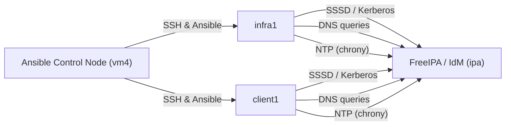

# Linux Enterprise Lab (Rocky/RHEL-style)

**Start here:** see **PORTFOLIO.md** for a curated tour of the best architecture, labs, and incident writeups.

This repo documents an enterprise-style Linux lab designed to practice **identity, DNS/NTP dependencies, security hardening, observability, and recovery** across multiple hosts.

It’s written like a runbook: **what I built → how to reproduce it → what broke → how I fixed it → how I hardened it.**.

---

## Design Philosophy

This lab emphasizes **failure-driven learning.**

Systems are intentionally misconfigured, stressed, or partially broken to simulate real-world incidents, followed by 
- root-cause analysis
- remediation
- prevention
- documentation

The goal is operational judgment, not just “getting it to work.”

---

## Goals

- Build a realistic multi-host environment (not a single-VM tutorial)
- Practice core sysadmin dependencies: **DNS, time sync, identity, SSH, sudo**
- Layer security controls in a deliberate order
- Apply automation *after* understanding the underlying failure modes
- Develop incident response and recovery habits

---

## Environment Overview

- Platform: VMware + AWS
- OS family: Rocky Linux 9 / RHEL-like
- Pattern:
    “Known-good base OS”
    → “Enroll to identity”
    → “Harden”
    → “Observe”
    → “Automate”
---

## Architecture

### Host Roles (example)
- `ipa` (Identity): FreeIPA (IdM), DNS (authoritative for lab domain)
- `infra1` (Infra services): supporting services and test workloads
- `client1` (Client): domain-enrolled workload node
- `vm4` (Automation): Ansible control node

### Diagram

See architecture/ for detailed network, identity, and observability designs.

### Repository Structure

| architecture/    | System and network design                | 
| ---------------- |:----------------------------------------:|
| labs/            | Reproducible walkthroughs                |
| troubleshooting/ | Incident reports and root-cause analysis |
| ansible/         | Automation and configuration management  |
| references/      | External and companion resources         |

---

## How to Use This Repo

1) Read the lab index

See labs/00-index.md for the recommended learning sequence.

2) Reproduce the environment (high level)

    1. Provision VMs (names + IPs)
    2. Configure networking + resolvers
    3. Install/configure FreeIPA + DNS
    4. Enroll clients (SSSD/Kerberos)
    5. Apply baseline hardening
    6. Apply Ansible roles for consistency

Each step is documented in `labs/` and `architecture/.`

---

## Security Hardening (layered)

This lab applies controls in layers so failures are debuggable:

1. firewalld baseline

2. SSH hardening (keys only, no root, explicit allowed groups)

3. auditd + rules (make changes observable)

4. SELinux enforcing (then tune based on audit logs)

5. patch policy (manual cadence + documentation)

See `labs/` and `troubleshooting/` for details.

---

## Observability and Reliability

Week 3 introduces a full observability and response loop:
- Prometheus + exporters
- Alertmanager
- Webhook automation
- Ansible remediation
- Bastion-secured access
- Private subnet controls

Documented in:

- `architecture/week3-observability.md`
- `labs/lab-week3-observability.md`

This simulates entry-level SRE / platform engineering workflows.

---

## Automation (Ansible)

Ansible contents live under `ansible/.`

- `playbooks/` – entry workflowss

- `roles/` – reusable roles (common/security/etc.)

- `inventory/` – inventory (sanitized examples)

---

## What Broke (and Fixes)

Failures are intentional and documented.

- SSH Access Blocked by AllowGroups Misconfiguration → `troubleshooting/ssh-hardening-ipa.md`

- Chrony Time Drift Causing Authentication Failures → `troubleshooting/chrony-unsynced.md`

- Bastion ProxyJump and SSH Key Selection Failure → `troubleshooting/week2-ssh-proxyjump-key-selection.md`

- Chrony Silent Failure from DNS Bootstrap Errors → `troubleshooting/week2-ntp-dns-bootstrap-failure.md`

---

## Related Repositories

- **Terraform Platform:** See `references/terraform-platform.md` for the dedicated IaC repo.

Additional platform-focused work lives in separate repositories.

---

## Roadmap (Next)

- Kickstart-based rebuilds (“nuke & pave” workload node)

- Centralized logging (rsyslog/journald forwarding)

- Compliance and scanning workflows

- Recovery and rebuild drills

- Expanded automation patterns

---

## Disclaimer

This repo is for learning. Sensitive values (real IPs, passwords, private keys, tokens) are excluded, redacted, or replaced with examples.
